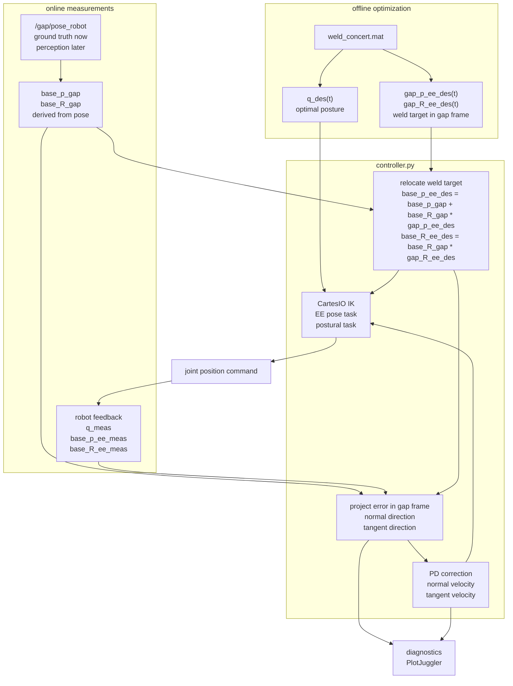

# acea_concert

Tools for optimizing and executing the CONCERT welding trajectory.

## Pipeline

The workflow is split into two parts:

1. Offline: run `weld_opt.py`, optionally replay with `replayer.py`, and inspect the RViz visualization.
2. Online: launch simulation, start XBot GUI, publish the current gap pose, compensate gravity, home to the optimized start, drive the base to the optimized pose, and run the controller.

## 0. Docker Environment

Start the Docker container before running the offline or online pipeline:

```bash
xhost +local:docker
cd /home/user/concert_ws/src/acea_concert/docker
docker compose up -d --build
docker compose exec dev bash
```

Open another terminal in the same running container when needed:

```bash
cd /home/user/concert_ws/src/acea_concert/docker
docker compose exec dev bash
```

Stop the container when finished:

```bash
cd /home/user/concert_ws/src/acea_concert/docker
docker compose down
```

## 1. Offline Optimization

Command pipeline:

```bash
cd /home/user/concert_ws/src/acea_concert
python3 src/weld_opt.py
python3 src/plan_homing_from_mat.py
python3 src/replayer.py
rviz2 -d rviz/rviz_config.rviz
```

Run the optimizer from the package root:

```bash
cd /home/user/concert_ws/src/acea_concert
python3 src/weld_opt.py
```

`src/weld_opt.py` solves the Horizon optimization problem and saves:

```text
mat_files/weld_concert.mat
```

The MAT file contains the optimized joint trajectory, the pipe/gap geometry, and the weld trajectory expressed in the gap frame. The online controller expects this file to exist before starting the simulation.

Optionally plan a collision-aware homing trajectory and save it back into the MAT file as `q_homing`:

```bash
cd /home/user/concert_ws/src/acea_concert
python3 src/plan_homing_from_mat.py
```

Optionally replay the optimized trajectory:

```bash
cd /home/user/concert_ws/src/acea_concert
python3 src/replayer.py
```

Use RViz to inspect the robot, pipe, and optimized weld trajectory:

```bash
rviz2 -d rviz/rviz_config.rviz
```

## 2. Online Controller

Start the standalone container with its default isolated Docker network:

```bash
docker compose -f docker/compose.yaml up -d
```

To communicate with ROS 2 outside the container, set the required host IP and
use the ROS launcher:

```bash
ROS2_IP=<host-IP-on-the-robot-network> ROS_DOMAIN_ID=0 docker/up-ros
```

The external ROS 2 machine must use the same `ROS_DOMAIN_ID` and
`RMW_IMPLEMENTATION=rmw_cyclonedds_cpp`.

Shut down either mode without setting `ROS2_IP`:

```bash
# Standalone
docker compose -f docker/compose.yaml down

# External ROS networking
docker compose \
  -f docker/compose.yaml \
  -f docker/compose.ros.yaml \
  down
```

Start each component in a separate terminal.

Run in this order:

1. `weld_sim.launch.py`
2. XBot GUI
3. gap pose GUI / publisher
4. `gravity_comp_node.py`
5. `home_to_weld_start.py`
6. `drive_base_to_weld_pose.py`
7. `controller.py`

### Terminal Environment

Open a terminal and connect to the container:

```bash
docker exec -it [container-id] bash

```
Open one Terminator window with a named pane for each component:

```bash
cd /home/user/concert_ws/src/acea_concert
scripts/concert_terminal
```

Each pane has the ROS/XBot/workspace environment loaded and shows its
ready-to-run command. Run them in the order listed above. Click a pane to focus
it; `Ctrl+Shift+X` expands the focused pane and restores the tiled layout.

For a normal terminal, source the same environment manually:

```bash
cd /home/user/concert_ws/src/acea_concert
source scripts/concert_env.bash
```

### Simulation

```bash
cd /home/user/concert_ws
ros2 launch acea_concert weld_sim.launch.py
```

This launches the robot simulation and spawns the two pipe halves using the geometry stored in `mat_files/weld_concert.mat`.

To use a different optimization result, pass `mat_file`. To start with the gap at the optimized pose relative to the robot, add `optimized_robot_pose:=true`:

```bash
ros2 launch acea_concert weld_sim.launch.py mat_file:=mat_files/weld_concert.mat optimized_robot_pose:=true
```

### Perception Simulation (`camera_F`)

The original `weld_sim.launch.py` remains standalone and uses the canonical
robot generator. It does not depend on the perception files and does not add
the wrist camera.

Use the perception wrapper when testing the V16 detector:

```bash
cd /home/user/concert_ws
ros2 launch acea_concert weld_sim_perception.launch.py \
  mat_file:=/home/user/concert_ws/src/acea_concert/mat_files/weld_concert.mat \
  optimized_robot_pose:=true
```

The wrapper calls `weld_sim.launch.py` and adds only the perception setup:

- wrist RGB-D camera `camera_F` and its ROS bridges;
- painted pipe with a physical dark inner wall visible through the gap;
- robot TF publication;
- XBot2 startup after the Gazebo clock is active.

These are already the wrapper defaults: `optimized_robot_pose:=true`,
`pipe_visual_preset:=painted_orange`,
`junction_visual_mode:=inner_wall`, `xbot2:=true`, `rviz:=false`, and the
unused front-camera bridges disabled. The two arguments in the command above
are kept explicit so the geometry source and optimized placement are obvious.
The wrapper also starts XBot2 only after the Gazebo clock is active and switches
`ros_ctrl` to `Running` as soon as XBot2 is ready.

The original launcher keeps `gui:=true` as its default. In a headless container
or an SSH session without working X11 forwarding, add `gui:=false`; otherwise
Qt will fail before the Gazebo server can stay up.

`optimized_robot_pose` places the pipe relative to the optimized welding pose;
it does **not** move the arm joints. Before checking the camera image or the
detector, run the project's homing sequence. A sky/background-only `camera_F`
image before homing is expected and is not a detector failure.

#### Welding-tool camera extrinsic

`camera_F` is mounted from the tool body frame at the mounting interface
(`end_effector_E`, or `end_effector_F` on the prismatic robot). This is
`TOOL_BASE` in the supplied holder CAD transform; `ee_E`/`ee_F` is a
separately rotated task frame at the torch tip.
The tool geometry is unchanged. The CAD pose is converted to the RealSense
xacro mount frame:

```text
xyz = [0.287780, 0.017500, 0.231314] m
rpy = [0, -20 deg, 180 deg]
```

Inspect the resulting optical transform while the simulation is running:

```bash
ros2 run tf2_ros tf2_echo \
  end_effector_E camera_F_depth_optical_frame
```

Relative to `end_effector_E`, the expected optical-centre translation is
`[0.292055, 0, 0.243060] m`. The expected rotation matrix is:

```text
 0.000000 -0.342020 -0.939693
 1.000000  0.000000  0.000000
 0.000000 -0.939693  0.342020
```

The CAD sheet prints this on negative X. It is applied turned 180 deg about Z
because `TOOL_BASE` faces the other way round to the arm flange: the robot's
own URDF, recorded in `acea_real_1`, carries the tool camera on positive X.

For a visual check in RViz:

1. set `Fixed Frame` to `end_effector_E` (`end_effector_F` for the prismatic
   robot);
2. add a `TF` display and enable `end_effector_E`, `camera_F_link` and
   `camera_F_depth_optical_frame`;
3. add `RobotModel` to inspect the camera body on the welding holder;
4. add an `Image` display on `/camera_F/color/image_raw` after homing.

Relative to the red/green/blue axes of `end_effector_E`, the optical origin
must be `[292.055, 0, 243.060] mm`, placing the camera above the holder as in
the CAD model. For the prismatic robot, replace `end_effector_E` with
`end_effector_F` in the `tf2_echo` command.

After homing, launch perception in another sourced terminal:

```bash
cd /home/user/concert_ws/src/acea_concert
source scripts/concert_env.bash

ros2 launch acea_concert detection_v16_dev.launch.py \
  use_sim_time:=true \
  camera_preset:=sim \
  sim_camera_name:=camera_F \
  mat_file:=/home/user/concert_ws/src/acea_concert/mat_files/weld_concert.mat \
  pipe_radius_m:=auto
```

Check the detector and controller-facing pose:

```bash
ros2 topic echo /acea/pipe_junction/status --once --field data
ros2 topic echo /gap/pose_robot --once
```

Do not run `gap_pose_publisher.py` at the same time as the detector: the former
publishes Gazebo ground truth on `/gap/pose_robot`, while the detector must be
the only publisher on that topic during perception tests.

### XBot GUI

Start the XBot GUI after the simulation is running.

### Gap Pose GUI / Ground Truth

```bash
cd /home/user/concert_ws/src/acea_concert
python3 src/gap_pose_publisher.py
```

Optional test faults can be added to the published `/gap/pose_robot`:

```bash
python3 src/gap_pose_publisher.py \
  --gap-pos-noise-std 0.01 \
  --gap-rot-noise-std 0.02 \
  --gap-disconnect-every 10 \
  --gap-disconnect-duration 2
```

This publishes the current gap pose with respect to `base_link`:

```text
/gap/pose_robot
```

This node is ground truth for simulation. In the real setup, it should be replaced by perception.

### Gravity Compensation

```bash
cd /home/user/concert_ws/src/acea_concert
python3 src/gravity_comp_node.py
```

### Home Weld Joints To Optimized Start

```bash
cd /home/user/concert_ws/src/acea_concert
python3 src/home_to_weld_start.py
```

### Drive Base To Optimized Weld Pose

```bash
cd /home/user/concert_ws/src/acea_concert
python3 src/drive_base_to_weld_pose.py
```

### Welding Controller

```bash
cd /home/user/concert_ws/src/acea_concert
python3 src/controller.py
```

To smooth noisy camera gap poses, enable the controller-side low-pass filter:

```bash
python3 src/controller.py --gap-filter-tau 0.1
```

With `scripts/concert_env.bash` sourced, the same command is:

```bash
concert_controller --gap-filter-tau 0.1
```

`0` disables the filter. A small value like `0.05`-`0.15` seconds is a good starting range.

To replay the optimized trajectory without `/gap/pose_robot`, run open-loop:

```bash
concert_controller --open-loop
```

For slow welding with noisy camera poses, use a history window and reject big
camera jumps:

```bash
concert_controller \
  --gap-filter-history-size 50 \
  --gap-filter-tau 0.3 \
  --gap-filter-max-position-jump 0.02 \
  --gap-filter-max-angle-jump 10
```

The controller uses:

```text
optimized posture trajectory from the MAT file
desired weld position in the gap frame
desired weld orientation in the gap frame
measured /gap/pose_robot from ground truth/perception
```

`/gap/pose_robot` is the only online gap input required by the controller. It is a `PoseStamped` in `base_link`: the position gives `base_p_gap`, and the quaternion gives `base_R_gap`.

At runtime it relocates the optimized weld trajectory onto the current measured gap:

```text
position:    base_p_ee_des = base_p_gap + base_R_gap * gap_p_ee_des
orientation: base_R_ee_des = base_R_gap * gap_R_ee_des
```

## Controller Pipeline

The controller does not blindly replay the optimized joint trajectory. The joint trajectory is used as a nominal posture, while the welding target is rebuilt online from the measured gap pose.



### Controller Inputs

From the MAT file:

```text
q_des(t)              optimized joint posture trajectory
gap_p_ee_des(t)       desired weld position expressed in the gap frame
gap_R_ee_des(t)       desired tool orientation expressed in the gap frame
```

From ground truth now, and from perception later:

```text
/gap/pose_robot       PoseStamped in base_link
base_p_gap            gap origin from /gap/pose_robot.position
base_R_gap            gap orientation from /gap/pose_robot.orientation
```

From robot feedback:

```text
q_meas                measured robot joint state
base_p_ee_meas        measured EE position from forward kinematics
base_R_ee_meas        measured EE orientation from forward kinematics
```

### Control Loop

At each controller tick:

1. Read `q_des(t)` and send it to the CartesIO postural task.
2. Read the desired weld position and orientation in the gap frame.
3. Read the current measured `/gap/pose_robot` in `base_link`.
4. Derive `base_p_gap` and `base_R_gap`, then convert the desired weld target from gap frame to `base_link`.
5. Compare the measured EE position with the desired weld target along:
   - the gap normal direction, across the pipes
   - the gap tangent direction, along the weld
6. Compute PD correction velocities along those two directions.
7. Command the EE pose task and postural task through CartesIO.
8. Publish diagnostics for PlotJuggler.

The key idea is that if the robot or gap moves, the weld target moves with the measured gap:

```text
base_p_ee_des = base_p_gap + base_R_gap * gap_p_ee_des
base_R_ee_des = base_R_gap * gap_R_ee_des
```

## Main Files

- `src/weld_opt.py`: offline trajectory optimization and MAT file generation.
- `src/plan_homing_from_mat.py`: adds a collision-aware `q_homing` trajectory to a MAT file.
- `src/replayer.py`: replay and RViz visualization of the optimized trajectory.
- `launch/weld_sim.launch.py`: simulation launch file; accepts `mat_file` and `optimized_start`.
- `src/gap_pose_publisher.py`: simulation ground-truth gap pose publisher.
- `src/gravity_comp_node.py`: gravity compensation node.
- `src/home_to_weld_start.py`: moves weld joints to trajectory node 0.
- `src/drive_base_to_weld_pose.py`: drives the mobile base to the optimized relative gap pose.
- `src/controller.py`: online welding controller.
- `src/controller_ros.py`: ROS interface for the controller.
- `src/utils/`: controller geometry, trajectory, and diagnostic helpers.

## Configuration

- `config/weld.yaml`: Horizon optimization task configuration.
- `config/cartesio_stack.yaml`: CartesIO stack used by the online controller.
- `src/modular/`: robot model generation.
- `mat_files/`: generated optimization results.

## Dependencies

- ROS 2 Jazzy
- Horizon
- CasADi
- XBot2
- CartesIO
- NumPy, SciPy, Matplotlib

## 3. Camera-Based Gap Perception (validated detector)

The `src/detection/` module replaces the Gazebo ground-truth
`gap_pose_publisher.py` with a real camera-based pipe-junction detector. It
publishes the same interface: `/gap/pose_robot` (`geometry_msgs/PoseStamped`,
frame `base_link`, y = pipe axis, x = radial, z = x cross y), so
`drive_base_to_weld_pose.py` and the controller consume it unchanged.

Validated results (2026-07-19, idle host):

- real-camera cloth/support bag: 1463/1463 required frames valid, zero
  stale/hidden/unsafe poses;
- full live simulation cycle (Gazebo + XBot2 + homing + 65 s trajectory):
  354/354 frames accepted, position error median 1.15 mm / p95 6.4 mm,
  orientation p95 0.30 deg, zero axis flips;
- output rate ~4.4 Hz in live simulation, ~7 Hz on real camera frames
  (single-thread CPU-bound; the controller was validated at these rates). The
  detector never publishes a predicted or held pose: silent frames are
  fail-closed by contract.

### Run the detector standalone with your own trajectory

Terminal A (simulation, or skip on the real robot):

```bash

source /home/user/env/bin/activate
source /opt/ros/jazzy/setup.bash
source install/setup.bash
source setup.bash
source /opt/xbot/setup.sh

ros2 launch acea_concert weld_sim_perception.launch.py \
  mat_file:=/home/user/concert_ws/src/acea_concert/mat_files/weld_concert.mat \
  optimized_robot_pose:=true
```

Terminal B (detector + pose bridge; use `camera_preset:=real` on the robot —
the simulation preset and its recovery paths are NOT loaded on real):

```bash
ros2 launch acea_concert detection_v16_dev.launch.py \
  use_sim_time:=true camera_preset:=sim sim_camera_name:=camera_F \
  mat_file:=/home/user/concert_ws/src/acea_concert/mat_files/weld_concert.mat \
  pipe_radius_m:=auto
```

Then run homing / base drive / controller exactly as in section 2; the
controller reads `/gap/pose_robot` from the detector instead of the ground
truth publisher. Do not run `gap_pose_publisher.py` at the same time on the
same topic (remap it to `/acea/ground_truth/gap_pose_robot` if you want the
comparison).
