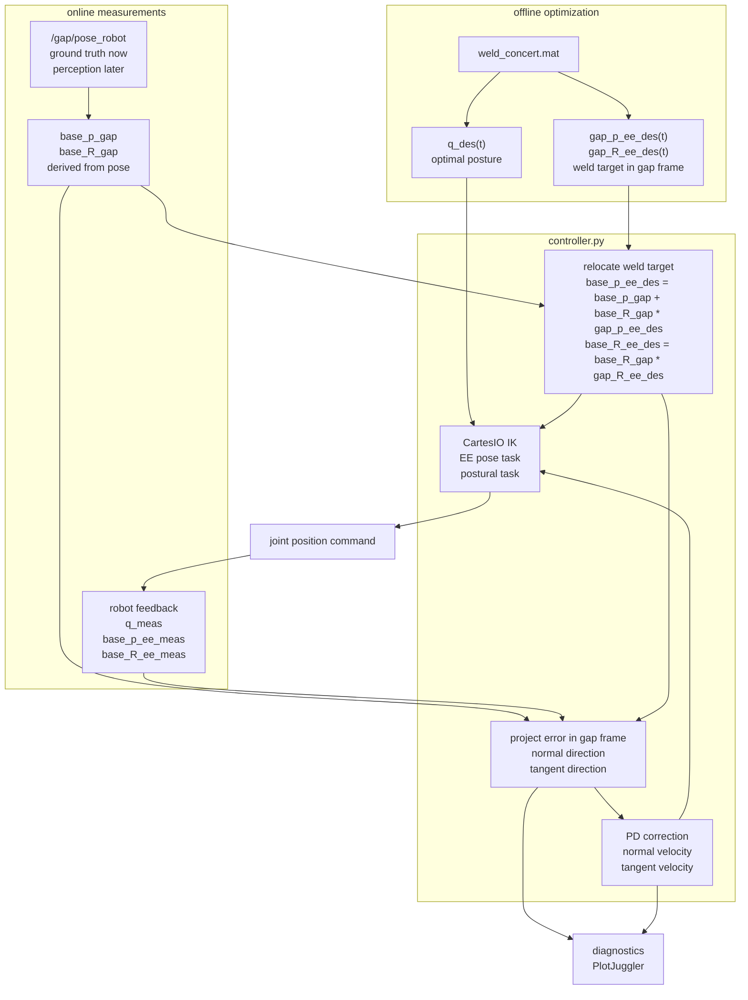

# acea_concert

Tools for optimizing and executing the CONCERT welding trajectory.

## Pipeline

The workflow is split into two parts:

1. Offline: run `weld_opt.py`, optionally replay with `replayer.py`, and inspect the RViz visualization.
2. Online: launch simulation, start XBot GUI, publish the current gap pose, compensate gravity, home to the optimized start, drive the base to the optimized pose, and run the controller.

## 0. Docker Environment

Start the Docker container before running the offline or online pipeline:

```bash
xhost +local:docker
cd /home/user/concert_ws/src/acea_concert/docker
docker compose up -d --build
docker compose exec dev bash
```

Open another terminal in the same running container when needed:

```bash
cd /home/user/concert_ws/src/acea_concert/docker
docker compose exec dev bash
```

Stop the container when finished:

```bash
cd /home/user/concert_ws/src/acea_concert/docker
docker compose down
```

## 1. Offline Optimization

Command pipeline:

```bash
cd /home/user/concert_ws/src/acea_concert
python3 src/weld_opt.py
python3 src/plan_homing_from_mat.py
python3 src/replayer.py
rviz2 -d rviz/rviz_config.rviz
```

Run the optimizer from the package root:

```bash
cd /home/user/concert_ws/src/acea_concert
python3 src/weld_opt.py
```

For the current ACEA welding-sector test, `src/weld_opt.py` is configured with:

```python
angle_weld_start = 1 / 2 * np.pi
angle_weld_end = np.pi
weld_upside_down = False
```

Run this optimization before launching the full welding simulation/controller so
`mat_files/weld_concert.mat` matches the expected sector.

`src/weld_opt.py` solves the Horizon optimization problem and saves:

```text
mat_files/weld_concert.mat
```

The MAT file contains the optimized joint trajectory, the pipe/gap geometry, and the weld trajectory expressed in the gap frame. The online controller expects this file to exist before starting the simulation.

Optionally plan a collision-aware homing trajectory and save it back into the MAT file as `q_homing`:

```bash
cd /home/user/concert_ws/src/acea_concert
python3 src/plan_homing_from_mat.py
```

Optionally replay the optimized trajectory:

```bash
cd /home/user/concert_ws/src/acea_concert
python3 src/replayer.py
```

Use RViz to inspect the robot, pipe, and optimized weld trajectory:

```bash
rviz2 -d rviz/rviz_config.rviz
```

## 2. Online Controller

Start each component in a separate terminal.

Run in this order:

1. `weld_sim.launch.py`
2. XBot GUI
3. gap pose GUI / publisher
4. `gravity_comp_node.py`
5. `home_to_weld_start.py`
6. `drive_base_to_weld_pose.py`
7. `controller.py`

### Terminal Environment

If you have `tmux`, create one ready-to-launch terminal session:

```bash
cd /home/user/concert_ws/src/acea_concert
scripts/concert_tmux
```

The script opens one tiled tmux window with named panes, sources the
ROS/XBot/workspace environment in each pane, and leaves the right command typed.
Click panes and press Enter in the order listed above. If you prefer tmux tabs,
run `scripts/concert_tmux --windows`.

For a normal terminal, source the same environment manually:

```bash
cd /home/user/concert_ws/src/acea_concert
source scripts/concert_env.bash
```

### Simulation

```bash
cd /home/user/concert_ws
ros2 launch acea_concert weld_sim.launch.py
```

This launches the robot simulation and spawns the two pipe halves using the geometry stored in `mat_files/weld_concert.mat`.

To use a different optimization result, pass `mat_file`. To start with the gap at the optimized pose relative to the robot, add `optimized_robot_pose:=true`:

```bash
ros2 launch acea_concert weld_sim.launch.py mat_file:=mat_files/weld_concert.mat optimized_robot_pose:=true
```

The short black cylindrical filler is preferred over the flat stripe for the
current simulation smoke test because it fills the actual junction volume. The
flat stripe is only a visual/debug aid and can interfere with manipulation tests
that rely on the pipe geometry.

### XBot GUI

Start the XBot GUI after the simulation is running.

### Gap Pose GUI / Ground Truth

```bash
cd /home/user/concert_ws/src/acea_concert
python3 src/gap_pose_publisher.py
```

Optional test faults can be added to the published `/gap/pose_robot`:

```bash
python3 src/gap_pose_publisher.py \
  --gap-pos-noise-std 0.01 \
  --gap-rot-noise-std 0.02 \
  --gap-disconnect-every 10 \
  --gap-disconnect-duration 2
```

This publishes the current gap pose with respect to `base_link`:

```text
/gap/pose_robot
```

This node is ground truth for simulation. In the real setup, it should be replaced by perception.

### Gap Pose From Perception

The perception replacement publishes the same controller contract:

```text
/gap/pose_robot
```

Launch it instead of `src/gap_pose_publisher.py` when RGB-D camera data and the
camera-to-`base_link` TF are available:

```bash
ros2 launch acea_concert detection.launch.py
```

Do not run the ground-truth publisher and the perception publisher at the same
time, because they publish the same `/gap/pose_robot` topic.

The perception pipeline is:

```text
D435i RGB/depth/camera_info
  -> acea_pipe_junction_node.py
  -> /acea/pipe_junction/detection
  -> /acea/weld_seam/gap_plane       camera frame
  -> gap_pose_robot_node.py
  -> /gap/pose_robot                 base_link
```

Default camera topics match `weld_sim.launch.py`:

```text
/D435i_camera_front/color/image_raw
/D435i_camera_front/depth_image
/D435i_camera_front/camera_info
```

To launch the detector with explicit topics:

```bash
ros2 launch acea_concert detection.launch.py \
  rgb_topic:=/D435i_camera_front/color/image_raw \
  depth_topic:=/D435i_camera_front/depth_image \
  camera_info_topic:=/D435i_camera_front/camera_info
```

For the current short black cylindrical filler smoke test, use the deterministic
RGB-only Variant A frontend:

```bash
ros2 launch acea_concert detection.launch.py \
  junction_acceptance_mode:=variant_a_rgb \
  use_depth_gap_gate:=false
```

Important: `config/detector.yaml` currently sets
`variant_a_min_vertical_run_px: 8`. This is intentionally permissive for the
short junction filler in the Gazebo smoke test. Before treating it as a robust
real/deployment setting, rerun no-gap and hard-negative checks because short
dark marks could otherwise become false positives.

For a real wrist camera, remap these three topics to the camera driver topics.
For example:

```bash
ros2 launch acea_concert detection.launch.py \
  rgb_topic:=/camera_front/color/image_raw \
  depth_topic:=/camera_front/aligned_depth_to_color/image_raw \
  camera_info_topic:=/camera_front/color/camera_info
```

The detector publishes the gap geometry only after an accepted detection. The
main debug topics are:

```bash
ros2 topic echo /acea/pipe_junction/detected
ros2 topic echo /acea/pipe_junction/status --field data
ros2 topic echo /acea/pipe_junction/detection --field data
ros2 topic echo /acea/weld_seam/gap_plane --field data
ros2 topic echo /gap/pose_robot
```

Debug image topics:

```bash
ros2 topic hz /acea/pipe_junction/debug/rgb_overlay
ros2 topic hz /acea/pipe_junction/debug/depth_overlay
```

`/acea/pipe_junction/debug/rgb_overlay` contains the camera image with the
detector overlay: the scan/search line is yellow/orange while searching, and the
accepted junction line is cyan when accepted. Use this topic in RViz/Image View
or with any ROS image viewer when visual debugging is needed.

Fast failure isolation:

```text
/acea/pipe_junction/status        empty or WAITING_FOR_* -> camera/sync problem
/acea/pipe_junction/detected      false                  -> detector has not accepted the gap
/acea/weld_seam/gap_plane         empty                  -> no accepted camera-frame gap geometry
/gap/pose_robot                   empty                  -> gap plane missing or camera->base_link TF missing
```

Expected successful detection:

```text
/acea/pipe_junction/detection:
  state = STOP_AND_LOCALIZE
  detector_accepted = true
  gap_plane_available = true
  weld_seam_pose_available = true

/acea/pipe_junction/detected:
  data = true

/acea/pipe_junction/status:
  detected = true
  state = STOP_AND_LOCALIZE

/acea/weld_seam/gap_plane:
  valid = true
  pose_valid = true
  frame_id = D435i_camera_front_depth_optical_frame

/gap/pose_robot:
  frame_id = base_link
```

`/gap/pose_robot` is not published if either:

1. the detector has not accepted the gap yet, or
2. the TF from the camera frame to `base_link` is missing.

Check the camera TF with:

```bash
ros2 run tf2_ros tf2_echo base_link D435i_camera_front_depth_optical_frame
```

If this transform is missing in simulation, launch `weld_sim.launch.py` with:

```text
publish_robot_state_tf:=true
realsense:=true
```

If this transform is missing on the real robot, start the proper
`robot_state_publisher`, XBot2 description publisher, or a calibrated static TF
for the wrist camera.

### Perception Smoke Test In Simulation

This is the current end-to-end command sequence for checking the simulated
front D435i camera, detector overlay, camera-frame gap plane, and final
`/gap/pose_robot` output.

Terminal 1, start Gazebo and the front camera bridges:

```bash
cd /home/user/concert_ws
source /opt/ros/jazzy/setup.bash
source /opt/xbot/setup.sh 2>/dev/null || true
source /home/user/concert_ws/install/setup.bash
export __EGL_VENDOR_LIBRARY_FILENAMES=/usr/share/glvnd/egl_vendor.d/10_nvidia.json
export __GLX_VENDOR_LIBRARY_NAME=nvidia

ros2 launch acea_concert weld_sim.launch.py \
  gui:=true \
  xbot2:=false \
  rviz:=false \
  realsense:=true \
  publish_robot_state_tf:=true \
  start_front_camera_bridges:=true \
  pipe_gap_m:=0.01 \
  pipe_z_m:=0.75 \
  spawn_gap_visual_marker:=true \
  spawn_gap_front_visual_stripe:=false
```

Terminal 2, start the perception replacement:

```bash
cd /home/user/concert_ws
source /opt/ros/jazzy/setup.bash
source /home/user/concert_ws/install/setup.bash

ros2 launch acea_concert detection.launch.py \
  junction_acceptance_mode:=variant_a_rgb \
  use_depth_gap_gate:=false
```

Terminal 3, inspect the state and outputs:

```bash
cd /home/user/concert_ws
source /opt/ros/jazzy/setup.bash
source /home/user/concert_ws/install/setup.bash

ros2 topic echo /acea/pipe_junction/status --field data
ros2 topic echo /acea/pipe_junction/detected
ros2 topic echo /acea/weld_seam/gap_plane --field data
ros2 topic echo /gap/pose_robot
```

Useful one-shot checks:

```bash
ros2 topic hz /D435i_camera_front/color/image_raw
ros2 topic hz /D435i_camera_front/depth_image
ros2 topic echo /acea/pipe_junction/status --field data --once
ros2 topic echo /acea/weld_seam/gap_plane --field data --once
ros2 topic echo /gap/pose_robot --once
ros2 run tf2_ros tf2_echo base_link D435i_camera_front_depth_optical_frame
```

To see what the detector is doing, open `rqt_image_view` and select:

```text
/acea/pipe_junction/debug/rgb_overlay
```

The overlay shows the scan/search line while searching and the accepted
junction line when the detector accepts the gap.

For the default 1 cm marker scene, the expected result is a valid detection and
a `/gap/pose_robot` message in `base_link`.

Expected successful status:

```text
/acea/pipe_junction/status:
  detected = true
  detector_accepted = true
  state = STOP_AND_LOCALIZE
  gap_plane_available = true
  weld_seam_pose_available = true

/gap/pose_robot:
  header.frame_id = base_link
```

If `/gap/pose_robot` is empty, debug in this order:

1. Check camera topics:
   ```bash
   ros2 topic hz /D435i_camera_front/color/image_raw
   ros2 topic hz /D435i_camera_front/depth_image
   ros2 topic hz /D435i_camera_front/camera_info
   ```
2. Check detector status:
   ```bash
   ros2 topic echo /acea/pipe_junction/status --field data --once
   ros2 topic echo /acea/pipe_junction/detected --once
   ```
3. Check camera-frame gap geometry:
   ```bash
   ros2 topic echo /acea/weld_seam/gap_plane --field data --once
   ```
4. Check the robot camera TF:
   ```bash
   ros2 run tf2_ros tf2_echo base_link D435i_camera_front_depth_optical_frame
   ```

Do not run `src/gap_pose_publisher.py` together with `detection.launch.py`, as
both publish `/gap/pose_robot`.

Current validation note: the perception chain publishes
`/acea/weld_seam/gap_plane` and `/gap/pose_robot`, but the numerical comparison
against the simulator ground-truth gap pose is still under debugging. Treat this
as a perception integration smoke test until the frame/ground-truth comparison
is closed.

### Gravity Compensation

```bash
cd /home/user/concert_ws/src/acea_concert
python3 src/gravity_comp_node.py
```

### Home Weld Joints To Optimized Start

```bash
cd /home/user/concert_ws/src/acea_concert
python3 src/home_to_weld_start.py
```

### Drive Base To Optimized Weld Pose

```bash
cd /home/user/concert_ws/src/acea_concert
python3 src/drive_base_to_weld_pose.py
```

### Welding Controller

```bash
cd /home/user/concert_ws/src/acea_concert
python3 src/controller.py
```

To smooth noisy camera gap poses, enable the controller-side low-pass filter:

```bash
python3 src/controller.py --gap-filter-tau 0.1
```

With `scripts/concert_env.bash` sourced, the same command is:

```bash
concert_controller --gap-filter-tau 0.1
```

`0` disables the filter. A small value like `0.05`-`0.15` seconds is a good starting range.

For slow welding with noisy camera poses, use a history window and reject big
camera jumps:

```bash
concert_controller \
  --gap-filter-history-size 50 \
  --gap-filter-tau 0.3 \
  --gap-filter-max-position-jump 0.02 \
  --gap-filter-max-angle-jump 10
```

The controller uses:

```text
optimized posture trajectory from the MAT file
desired weld position in the gap frame
desired weld orientation in the gap frame
measured /gap/pose_robot from ground truth/perception
```

`/gap/pose_robot` is the only online gap input required by the controller. It is a `PoseStamped` in `base_link`: the position gives `base_p_gap`, and the quaternion gives `base_R_gap`.

At runtime it relocates the optimized weld trajectory onto the current measured gap:

```text
position:    base_p_ee_des = base_p_gap + base_R_gap * gap_p_ee_des
orientation: base_R_ee_des = base_R_gap * gap_R_ee_des
```

## Controller Pipeline

The controller does not blindly replay the optimized joint trajectory. The joint trajectory is used as a nominal posture, while the welding target is rebuilt online from the measured gap pose.



### Controller Inputs

From the MAT file:

```text
q_des(t)              optimized joint posture trajectory
gap_p_ee_des(t)       desired weld position expressed in the gap frame
gap_R_ee_des(t)       desired tool orientation expressed in the gap frame
```

From ground truth now, and from perception later:

```text
/gap/pose_robot       PoseStamped in base_link
base_p_gap            gap origin from /gap/pose_robot.position
base_R_gap            gap orientation from /gap/pose_robot.orientation
```

From robot feedback:

```text
q_meas                measured robot joint state
base_p_ee_meas        measured EE position from forward kinematics
base_R_ee_meas        measured EE orientation from forward kinematics
```

### Control Loop

At each controller tick:

1. Read `q_des(t)` and send it to the CartesIO postural task.
2. Read the desired weld position and orientation in the gap frame.
3. Read the current measured `/gap/pose_robot` in `base_link`.
4. Derive `base_p_gap` and `base_R_gap`, then convert the desired weld target from gap frame to `base_link`.
5. Compare the measured EE position with the desired weld target along:
   - the gap normal direction, across the pipes
   - the gap tangent direction, along the weld
6. Compute PD correction velocities along those two directions.
7. Command the EE pose task and postural task through CartesIO.
8. Publish diagnostics for PlotJuggler.

The key idea is that if the robot or gap moves, the weld target moves with the measured gap:

```text
base_p_ee_des = base_p_gap + base_R_gap * gap_p_ee_des
base_R_ee_des = base_R_gap * gap_R_ee_des
```

## Main Files

- `src/weld_opt.py`: offline trajectory optimization and MAT file generation.
- `src/plan_homing_from_mat.py`: adds a collision-aware `q_homing` trajectory to a MAT file.
- `src/replayer.py`: replay and RViz visualization of the optimized trajectory.
- `launch/weld_sim.launch.py`: simulation launch file; accepts `mat_file` and `optimized_start`.
- `src/gap_pose_publisher.py`: simulation ground-truth gap pose publisher.
- `launch/detection.launch.py`: perception launch file for detector + gap pose transform.
- `src/detection/acea_pipe_junction_node.py`: RGB-D gap detector and camera-frame gap plane publisher.
- `src/detection/gap_pose_robot_node.py`: transforms camera-frame gap geometry into `/gap/pose_robot` in `base_link`.
- `config/detector.yaml`: detector topic and perception parameters.
- `config/gap_pose_robot.yaml`: `/gap/pose_robot` TF/config parameters.
- `src/gravity_comp_node.py`: gravity compensation node.
- `src/home_to_weld_start.py`: moves weld joints to trajectory node 0.
- `src/drive_base_to_weld_pose.py`: drives the mobile base to the optimized relative gap pose.
- `src/controller.py`: online welding controller.
- `src/controller_ros.py`: ROS interface for the controller.
- `src/utils/`: controller geometry, trajectory, and diagnostic helpers.

## Configuration

- `config/weld.yaml`: Horizon optimization task configuration.
- `config/cartesio_stack.yaml`: CartesIO stack used by the online controller.
- `src/modular/`: robot model generation.
- `mat_files/`: generated optimization results.

## Dependencies

- ROS 2 Jazzy
- Horizon
- CasADi
- XBot2
- CartesIO
- NumPy, SciPy, Matplotlib
