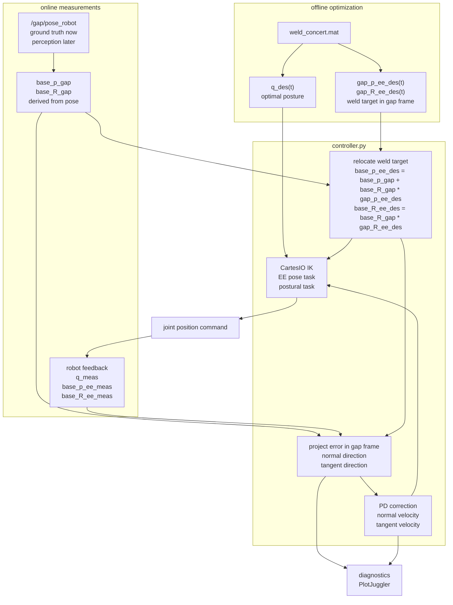

# acea_concert

Tools for optimizing and executing the CONCERT welding trajectory.

## Pipeline

The workflow is split into two parts:

1. Offline: run `weld_opt.py`, optionally replay with `replayer.py`, and inspect the RViz visualization.
2. Online: launch simulation, start XBot GUI, publish the current gap pose, compensate gravity, home to the optimized start, drive the base to the optimized pose, and run the controller.

## 0. Docker Environment

Start the Docker container before running the offline or online pipeline:

```bash
xhost +local:docker
cd /home/user/concert_ws/src/acea_concert/docker
docker compose up -d --build
docker compose exec dev bash
```

Open another terminal in the same running container when needed:

```bash
cd /home/user/concert_ws/src/acea_concert/docker
docker compose exec dev bash
```

Stop the container when finished:

```bash
cd /home/user/concert_ws/src/acea_concert/docker
docker compose down
```

## 1. Offline Optimization

Command pipeline:

```bash
cd /home/user/concert_ws/src/acea_concert
python3 src/weld_opt.py
python3 src/plan_homing_from_mat.py
python3 src/replayer.py
rviz2 -d rviz/rviz_config.rviz
```

Run the optimizer from the package root:

```bash
cd /home/user/concert_ws/src/acea_concert
python3 src/weld_opt.py
```

`src/weld_opt.py` solves the Horizon optimization problem and saves:

```text
mat_files/weld_concert.mat
```

The MAT file contains the optimized joint trajectory, the pipe/gap geometry, and the weld trajectory expressed in the gap frame. The online controller expects this file to exist before starting the simulation.

Optionally plan a collision-aware homing trajectory and save it back into the MAT file as `q_homing`:

```bash
cd /home/user/concert_ws/src/acea_concert
python3 src/plan_homing_from_mat.py
```

Optionally replay the optimized trajectory:

```bash
cd /home/user/concert_ws/src/acea_concert
python3 src/replayer.py
```

Use RViz to inspect the robot, pipe, and optimized weld trajectory:

```bash
rviz2 -d rviz/rviz_config.rviz
```

## 2. Online Controller

Start each component in a separate terminal.

Run in this order:

1. `weld_sim.launch.py`
2. XBot GUI
3. gap pose GUI / publisher
4. `gravity_comp_node.py`
5. `home_to_weld_start.py`
6. `drive_base_to_weld_pose.py`
7. `controller.py`

### Simulation

```bash
cd /home/user/concert_ws
ros2 launch acea_concert weld_sim.launch.py
```

This launches the robot simulation and spawns the two pipe halves using the geometry stored in `mat_files/weld_concert.mat`.

To use a different optimization result, pass `mat_file`. To start with the gap at the optimized pose relative to the robot, add `optimized_start:=true`:

```bash
ros2 launch acea_concert weld_sim.launch.py mat_file:=mat_files/weld_concert.mat optimized_start:=true
```

### XBot GUI

Start the XBot GUI after the simulation is running.

### Gap Pose GUI / Ground Truth

```bash
cd /home/user/concert_ws/src/acea_concert
python3 src/gap_pose_publisher.py
```

This publishes the current gap pose with respect to `base_link`:

```text
/gap/pose_robot
```

This node is ground truth for simulation. In the real setup, it should be replaced by perception.

### Gravity Compensation

```bash
cd /home/user/concert_ws/src/acea_concert
python3 src/gravity_comp_node.py
```

### Home Weld Joints To Optimized Start

```bash
cd /home/user/concert_ws/src/acea_concert
python3 src/home_to_weld_start.py
```

### Drive Base To Optimized Weld Pose

```bash
cd /home/user/concert_ws/src/acea_concert
python3 src/drive_base_to_weld_pose.py
```

### Welding Controller

```bash
cd /home/user/concert_ws/src/acea_concert
python3 src/controller.py
```

The controller uses:

```text
optimized posture trajectory from the MAT file
desired weld position in the gap frame
desired weld orientation in the gap frame
measured /gap/pose_robot from ground truth/perception
```

`/gap/pose_robot` is the only online gap input required by the controller. It is a `PoseStamped` in `base_link`: the position gives `base_p_gap`, and the quaternion gives `base_R_gap`.

At runtime it relocates the optimized weld trajectory onto the current measured gap:

```text
position:    base_p_ee_des = base_p_gap + base_R_gap * gap_p_ee_des
orientation: base_R_ee_des = base_R_gap * gap_R_ee_des
```

## Controller Pipeline

The controller does not blindly replay the optimized joint trajectory. The joint trajectory is used as a nominal posture, while the welding target is rebuilt online from the measured gap pose.



### Controller Inputs

From the MAT file:

```text
q_des(t)              optimized joint posture trajectory
gap_p_ee_des(t)       desired weld position expressed in the gap frame
gap_R_ee_des(t)       desired tool orientation expressed in the gap frame
```

From ground truth now, and from perception later:

```text
/gap/pose_robot       PoseStamped in base_link
base_p_gap            gap origin from /gap/pose_robot.position
base_R_gap            gap orientation from /gap/pose_robot.orientation
```

From robot feedback:

```text
q_meas                measured robot joint state
base_p_ee_meas        measured EE position from forward kinematics
base_R_ee_meas        measured EE orientation from forward kinematics
```

### Control Loop

At each controller tick:

1. Read `q_des(t)` and send it to the CartesIO postural task.
2. Read the desired weld position and orientation in the gap frame.
3. Read the current measured `/gap/pose_robot` in `base_link`.
4. Derive `base_p_gap` and `base_R_gap`, then convert the desired weld target from gap frame to `base_link`.
5. Compare the measured EE position with the desired weld target along:
   - the gap normal direction, across the pipes
   - the gap tangent direction, along the weld
6. Compute PD correction velocities along those two directions.
7. Command the EE pose task and postural task through CartesIO.
8. Publish diagnostics for PlotJuggler.

The key idea is that if the robot or gap moves, the weld target moves with the measured gap:

```text
base_p_ee_des = base_p_gap + base_R_gap * gap_p_ee_des
base_R_ee_des = base_R_gap * gap_R_ee_des
```

## Main Files

- `src/weld_opt.py`: offline trajectory optimization and MAT file generation.
- `src/plan_homing_from_mat.py`: adds a collision-aware `q_homing` trajectory to a MAT file.
- `src/replayer.py`: replay and RViz visualization of the optimized trajectory.
- `launch/weld_sim.launch.py`: simulation launch file; accepts `mat_file` and `optimized_start`.
- `src/gap_pose_publisher.py`: simulation ground-truth gap pose publisher.
- `src/gravity_comp_node.py`: gravity compensation node.
- `src/home_to_weld_start.py`: moves weld joints to trajectory node 0.
- `src/drive_base_to_weld_pose.py`: drives the mobile base to the optimized relative gap pose.
- `src/controller.py`: online welding controller.
- `src/controller_ros.py`: ROS interface for the controller.
- `src/utils/`: controller geometry, trajectory, and diagnostic helpers.

## Configuration

- `config/weld.yaml`: Horizon optimization task configuration.
- `config/cartesio_stack.yaml`: CartesIO stack used by the online controller.
- `src/modular/`: robot model generation.
- `mat_files/`: generated optimization results.

## Dependencies

- ROS 2 Jazzy
- Horizon
- CasADi
- XBot2
- CartesIO
- NumPy, SciPy, Matplotlib
